Question 1
----------

``` r
library(tidyverse)
```

    ## -- Attaching packages --------------------------------------- tidyverse 1.3.0 --

    ## v ggplot2 3.2.1     v purrr   0.3.3
    ## v tibble  3.0.5     v dplyr   1.0.3
    ## v tidyr   1.1.2     v stringr 1.4.0
    ## v readr   1.3.1     v forcats 0.4.0

    ## -- Conflicts ------------------------------------------ tidyverse_conflicts() --
    ## x dplyr::filter() masks stats::filter()
    ## x dplyr::lag()    masks stats::lag()

``` r
gas <- read.csv("../../../../../GitHub/ECO395M/data/GasPrices.csv")

gas %>%
  group_by(Competitors) %>%
  summarize(avg_price = mean(Price))
```

    ## # A tibble: 2 x 2
    ##   Competitors avg_price
    ## * <fct>           <dbl>
    ## 1 N                1.88
    ## 2 Y                1.85

``` r
gas %>%
  group_by(Competitors) %>%
  ggplot()+
  geom_boxplot(aes(y=Price,x=Competitors))
```

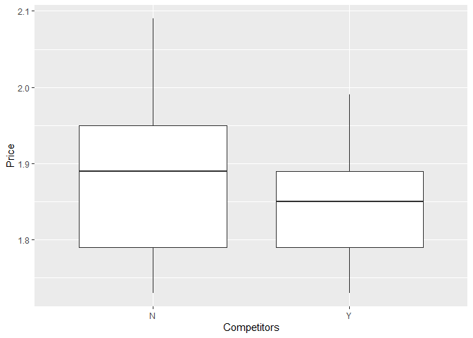

There is modest evidence that gas stations within sight of competitors
charge lower prices. They also tend to have less variance in prices.

``` r
gas %>%
  ggplot()+
  geom_point(aes(y=Price,x=Income))+
  geom_smooth(method=lm,aes(y=Price,x=Income))
```

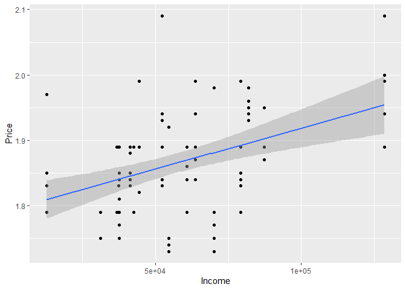

Strong evidence suggesting richer areas have higher prices.

``` r
gas %>%
  group_by(Brand) %>%
  summarize(avg_price = mean(Price)) %>%
  ggplot()+
  geom_col(aes(x=Brand,y=avg_price))
```

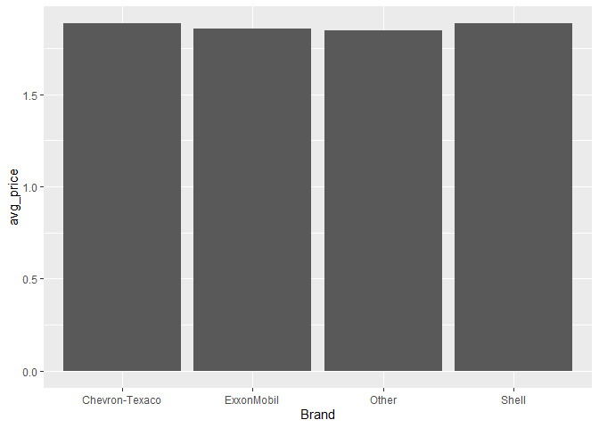

No evidence that any brand charges particularly higher prices.

``` r
gas %>%
  ggplot()+
  geom_histogram(aes(Price))+
  facet_grid(rows = vars(IntersectionStoplight))
```

    ## `stat_bin()` using `bins = 30`. Pick better value with `binwidth`.

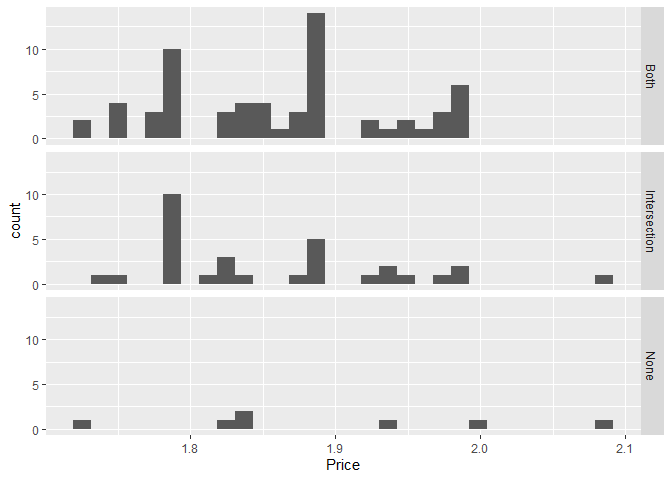

There is not enough data to make a clear pronouncement, but gas stations
next to both a stoplight and intersection appear to charge slightly
more.

``` r
gas %>%
  group_by(Highway) %>%
  ggplot()+
  geom_violin(aes(y=Price,x=Highway))
```

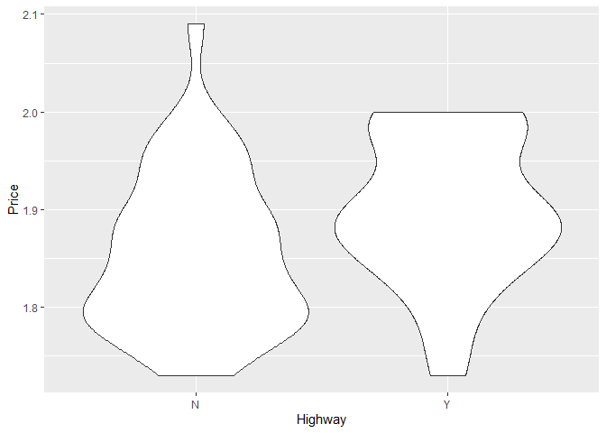

``` r
gas %>%
  group_by(Highway) %>%
  ggplot()+
  geom_histogram(aes(x=Price))+
  facet_grid(rows=vars(Highway))
```

    ## `stat_bin()` using `bins = 30`. Pick better value with `binwidth`.

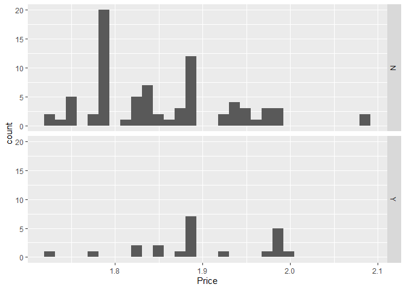

Stations near the highway charge more than those far from the highway.

Question 2
----------

``` r
bike <- read.csv("../../../../../GitHub/ECO395M/data/bikeshare.csv")

bike %>%
  ggplot()+
  geom_boxplot(aes(hr,total,group=hr))+
  geom_line(aes(hr,total),stat = "summary", fun.y = "mean",size=2,alpha=.2,color="blue")
```

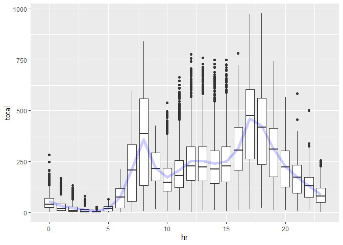

Average bike rentals per hour of the day. Average line is in blue, while
boxplots show the shape of the variance.

``` r
bike %>%
  ggplot()+
  geom_boxplot(aes(hr,total,group=hr))+
  geom_line(aes(hr,total),stat = "summary", fun.y = "mean",size=2,alpha=.2,color="blue")+
  facet_grid(rows = vars(workingday))
```

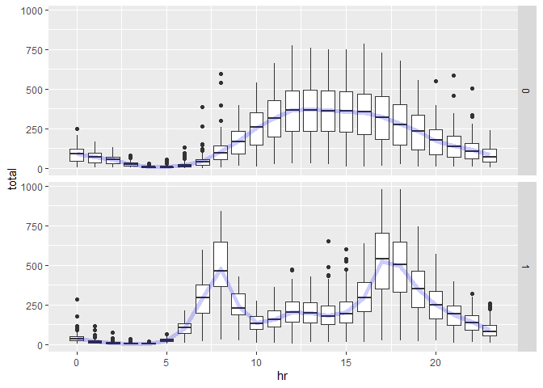

Faceting on whether it is a working day, it’s clear that on workdays
there is higher demand around commuting hours while on weekends the
mid-afternoon tends to be peak demand.

``` r
workday_labs <- c("NW", "W")
names(workday_labs) <- c("0", "1")

bike %>%
  filter(hr=="8") %>%
  mutate(weathersit = as.factor(weathersit))%>%
  ggplot() +
  geom_bar(aes(x=weathersit,y=total,fill=weathersit),stat = "summary", fun.y = "mean")+
  facet_grid(. ~ workingday, labeller = labeller(workingday = workday_labs))+
  scale_x_discrete(labels = c("Clear","Mist/Cloud","Rain"))+
  theme(axis.title.x = element_blank(),legend.position = "none")+
  ylab(label = "average rides")
```

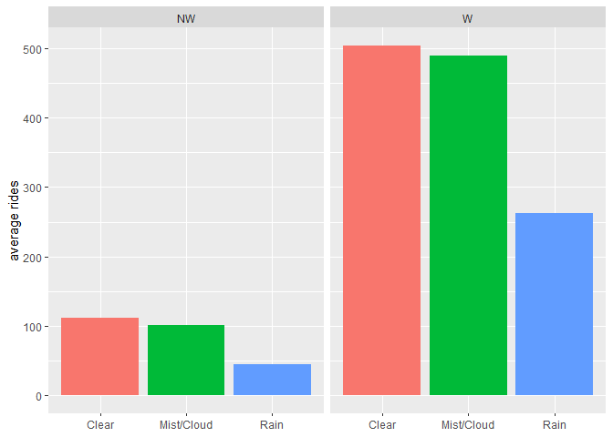

“NW” represents nonworking days, where we see a significant difference
if it is raining versus non-raining days.

Question 3
==========

``` r
air <- read.csv("../../../../../GitHub/ECO395M/data/ABIA.csv")

air$Date <- as.Date(paste(air$Year,air$Month,air$DayofMonth,sep="-"),format="%Y-%m-%d")

air_taxi <- air %>%
  select(Origin,WeatherDelay,TaxiIn,TaxiOut,FlightNum,Month,DepTime,ArrTime) %>%
  mutate(WeatherDelay = ifelse(is.na(air$WeatherDelay),0,air$WeatherDelay),
         unique_id = paste(air$Date,FlightNum,sep="-"),
         to_from = ifelse(Origin=="AUS","Outbound","Inbound")) %>%
  pivot_longer(cols=c("TaxiIn","TaxiOut"),names_to="Taxi",values_to="TaxiTime")
```

``` r
air %>%
  filter() %>%
  ggplot()+
  geom_bin2d(aes(TaxiIn,TaxiOut))+
  geom_smooth(aes(TaxiIn,TaxiOut),method = "lm")
```

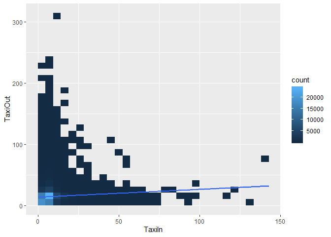

Plotting TaxiIn and TaxiOut density against each other and adding an OLS
line to see relationships. We see a weak but noticeable correlation
between TaxiIn and TaxiOut times. There is no reasonable expectation
that these two would have a causal relationship with each other. What
causes the variance in TaxiIn and TaxiOut?

``` r
air_taxi %>%
  ggplot()+
  geom_histogram(aes(TaxiTime),bins = 50)+
  facet_grid(Taxi~to_from)+
  xlim(0,50)
```

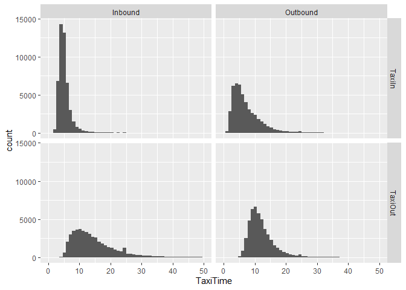

This breakdown shows histograms of taxi times based on whether the taxi
was leaving or arriving at the airport and whether the flight was
inbound or outbound.

TaxiIn + Inbound & TaxiOut + Outbound represent the time it took the
taxi to go get the passenger, so the car was empty for this leg of the
taxi trip. Taxis to the airport for outbound flights have the highest
density around 5 minutes and the distribution is extremely tight
compared to all other distributions.

``` r
air_taxi %>%
  ggplot()+
  geom_smooth(aes(Month,TaxiTime))+
  facet_grid(Taxi~to_from)+
  scale_x_continuous(breaks = c(1:12))
```

    ## `geom_smooth()` using method = 'gam' and formula 'y ~ s(x, bs = "cs")'

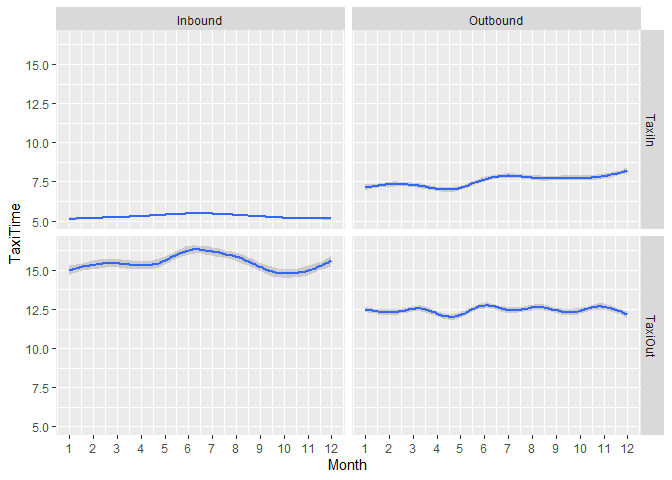

Breaking Taxi times out in the same way as the previous one, but this
time plotted against month of the year, seeing if there is a notable
difference. There appears to be perhaps a little seasonality to this
data (especially for TaxiOut Inbound flights), but not of particularly
large magnitude.

``` r
air_taxi %>%
  #filter((Origin %in% c("AUS"))) %>%
  filter(!is.na(TaxiTime)) %>%
  ggplot()+
  geom_jitter(aes(WeatherDelay,TaxiTime,group=Taxi,color=Taxi),alpha=.1)+
  geom_smooth(aes(WeatherDelay,TaxiTime,group=Taxi,color=Taxi),method = "lm")
```

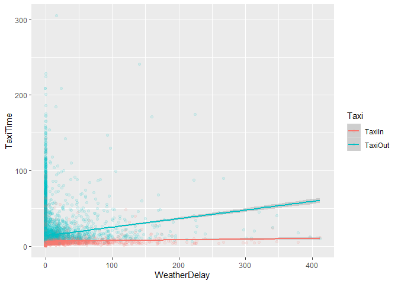

Plotting the influence of weather delays on Taxi times, we see that
weather does play a small but important role in the determining ride
times.

``` r
air_taxi %>%
  #filter((Origin %in% c("AUS"))) %>%
  filter(!is.na(TaxiTime)) %>%
  ggplot()+
  geom_jitter(aes(DepTime,TaxiTime,group=Taxi,color=Taxi),alpha=.01)+
  geom_smooth(aes(DepTime,TaxiTime,group=Taxi,color=Taxi))+
  facet_grid(to_from~.)+
  ylim(0,50)
```

    ## `geom_smooth()` using method = 'gam' and formula 'y ~ s(x, bs = "cs")'

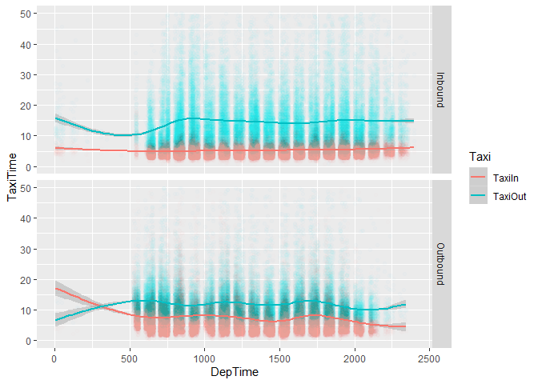

``` r
air_taxi %>%
  #filter((Origin %in% c("AUS"))) %>%
  filter(!is.na(TaxiTime)) %>%
  ggplot()+
  geom_jitter(aes(ArrTime,TaxiTime,group=Taxi,color=Taxi),alpha=.01)+
  geom_smooth(aes(ArrTime,TaxiTime,group=Taxi,color=Taxi))+
  facet_grid(to_from~.)+
  ylim(0,50)
```

    ## `geom_smooth()` using method = 'gam' and formula 'y ~ s(x, bs = "cs")'

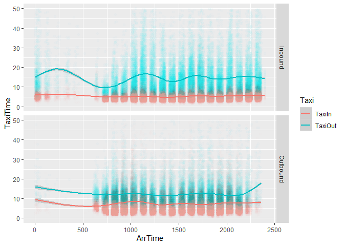

This chart shows average TaxiIn and TaxiOut time by time of day.

Though both are extremely varied, there is a clear pattern in that
TaxiIn is consistently lower than TaxiOut, suggesting rides to the
airport are shorter than rides from the airport regardless of TOD. For
TaxiOut, there is a clear change based on time of day, with modest
increases in ride times around noon and 6pm, coinciding with
high-traffic periods.

Lower TaxiIn adds to the hypothesis that TaxiIn rides may be coming from
downtown, while TaxiOut rides tend to come from a wider radius of the
ATX region.

Question 4
----------

``` r
sclass <- read.csv("../../../../../GitHub/ECO395M/data/sclass.csv")

library("tidyverse")
library("caret") 
library("foreach")
library("modelr")
library("rsample")

set.seed(1000)

sc350 <- sclass %>%
  filter(trim == "350") %>%
  select(mileage,price)

sc65 <- sclass %>%
  filter(trim == "65 AMG") %>%
  select(mileage,price)

sc350_split =  initial_split(sc350, prop=0.6)
sc350_train = training(sc350_split)
sc350_test  = testing(sc350_split)

sc65_split =  initial_split(sc65, prop=0.6)
sc65_train = training(sc65_split)
sc65_test  = testing(sc65_split)
```

### Trim 350

``` r
k <- c(1:20,30,35,40, 45,
       50, 60, 70, 80, 90, 100, 125, 150, 175)

rmse_350 <- c()

plot350 <- sc350_test %>%
  ggplot()+
  geom_point(aes(mileage,price))

for(i in c(1:length(k))){
k350 <- knnreg(data = sc350_train,price ~ mileage,k=k[i])
rmse_350 <- c(rmse_350,rmse(k350,data = sc350_test))
sc350_test$predval <- predict(k350,newdata = sc350_test)
plot350 <- plot350+
  geom_line(data=sc350_test,aes(mileage,predval),alpha=.2,size=.8)
}

plot350
```

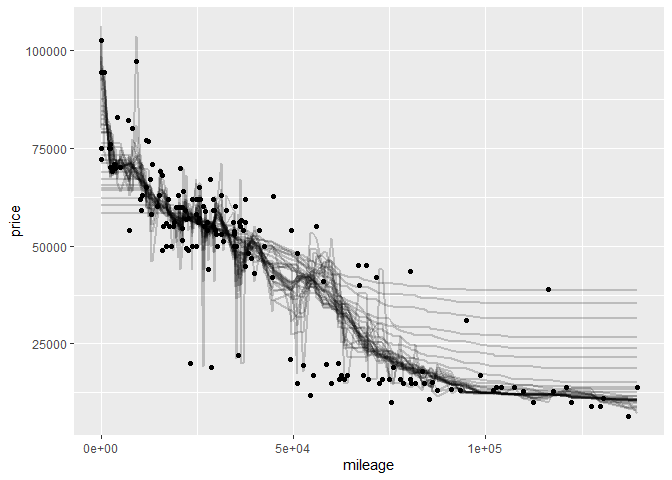

``` r
rmse_350 <- data.frame(cbind(rmse_350,k))

ggplot()+
  geom_point(data=rmse_350,aes(k,rmse_350))
```

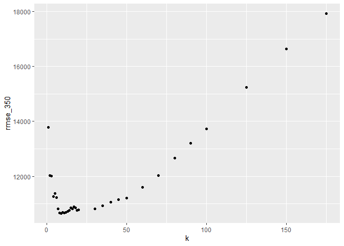

``` r
print(paste("The value of k with lowest RMSE is:",rmse_350[rmse_350$rmse_350 == min(rmse_350$rmse_350),"k"]))
```

    ## [1] "The value of k with lowest RMSE is: 9"

``` r
k_350 <- rmse_350[rmse_350$rmse_350 == min(rmse_350$rmse_350),"k"]
```

### Trim 65 AMG

``` r
k <- c(1:25,30,35,40, 45,
       50, 60, 70, 80, 90, 100)

rmse_65 <- c()

plot65 <- sc65_test %>%
  ggplot()+
  geom_point(aes(mileage,price))

for(i in c(1:length(k))){
k65 <- knnreg(data = sc65_train,price ~ mileage,k=k[i])
rmse_65 <- c(rmse_65,rmse(k65,data = sc65_test))
sc65_test$predval <- predict(k65,newdata = sc65_test)
plot65 <- plot65+
  geom_line(data=sc65_test,aes(mileage,predval),alpha=.2,size=.8)
}

plot65
```

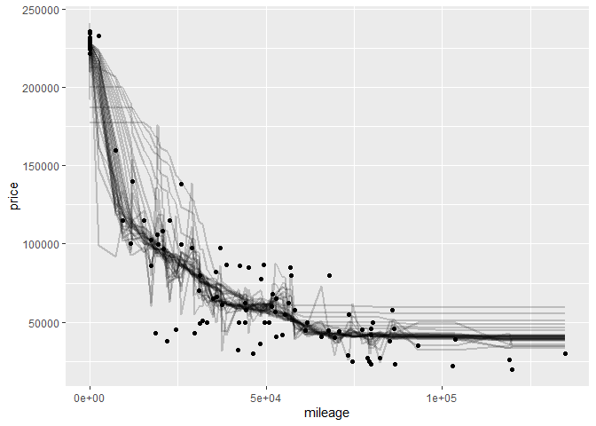

``` r
rmse_65 <- data.frame(cbind(rmse_65,k))

ggplot()+
  geom_point(data=rmse_65,aes(k,rmse_65))+
  theme_minimal()
```

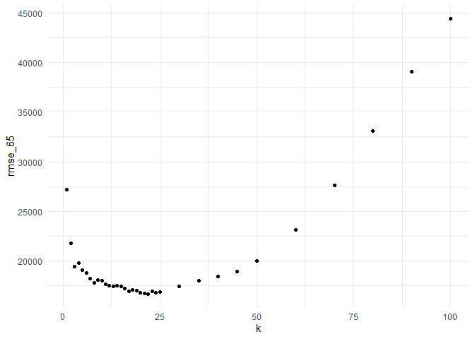

``` r
print(paste("The value of k with lowest RMSE is:",rmse_65[rmse_65$rmse_65 == min(rmse_65$rmse_65),"k"]))
```

    ## [1] "The value of k with lowest RMSE is: 22"

``` r
k_65 <- rmse_65[rmse_65$rmse_65 == min(rmse_65$rmse_65),"k"]
```

### Final Plot

``` r
library("viridis")  
```

    ## Loading required package: viridisLite

``` r
library("tidyverse")  
library("tidyverse")
library("caret") 
library("foreach")
library("modelr")
library("rsample")

model_plot <- sclass %>% 
  filter(trim %in% c("350","63 AMG")) %>%
  ggplot()+
  geom_point(aes(mileage,price,color=trim),alpha=.1)+
  scale_color_manual(values=viridis(c(5))[c(2,4)])

sc350_test$predval <- predict(knnreg(data = sc350_train,price ~ mileage,k=k_350),
                              newdata = sc350_test)
model_plot <- model_plot +
  geom_line(data=sc350_test,aes(mileage,predval),color=viridis(c(5))[2],size=1)


sc65_test$predval <- predict(knnreg(data = sc65_train,price ~ mileage,k=k_65),
                              newdata = sc65_test)
model_plot <- model_plot +
  geom_line(data=sc65_test,aes(mileage,predval),color=viridis(c(5))[4],size=1)

model_plot
```

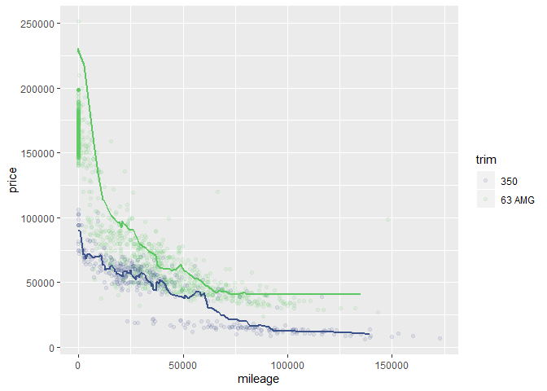

350 yields lower optimal K values, likely because it has many more
observations and a dataset that is more regularly distributed. The 65
AMG data has a weird gap in the price data near the x axis which is
likely causing issues with estimation and driving up RMSE.
