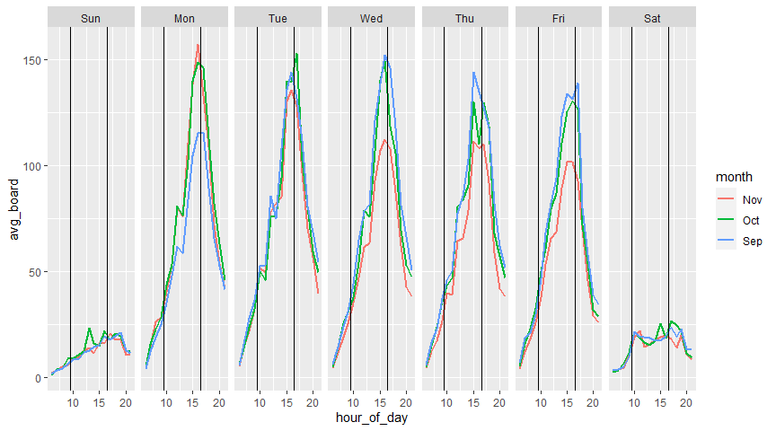
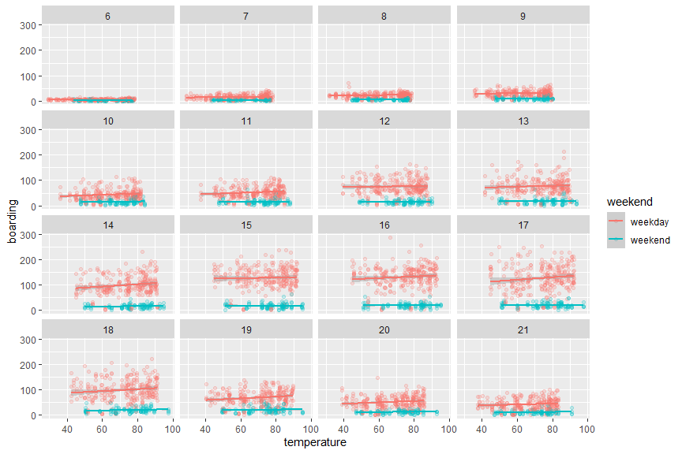
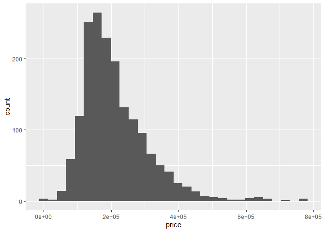
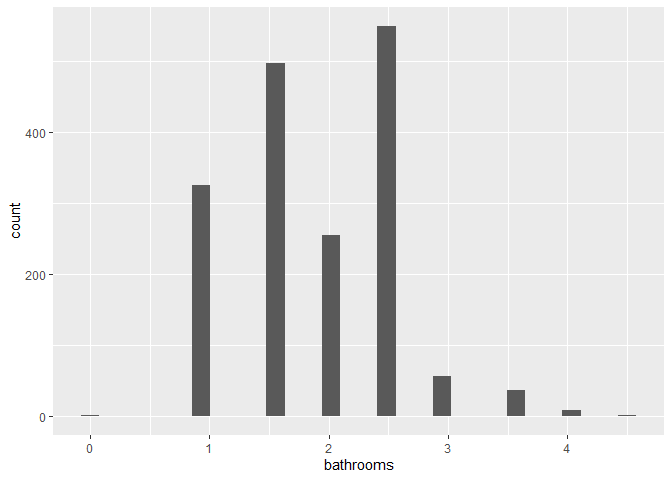
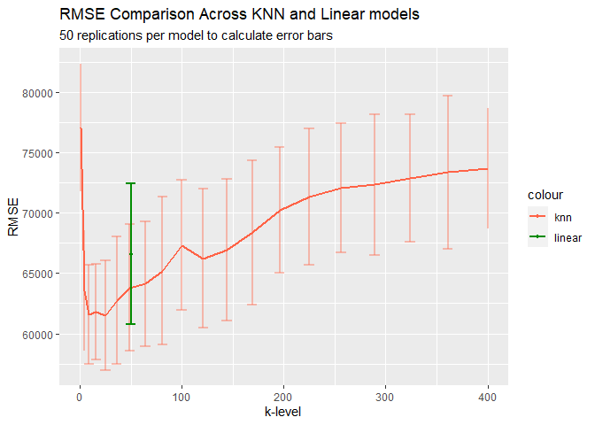
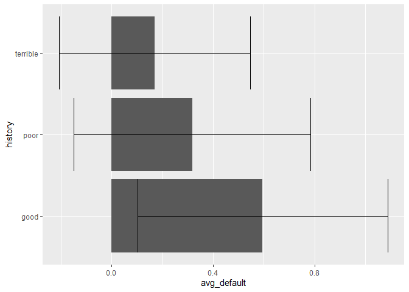
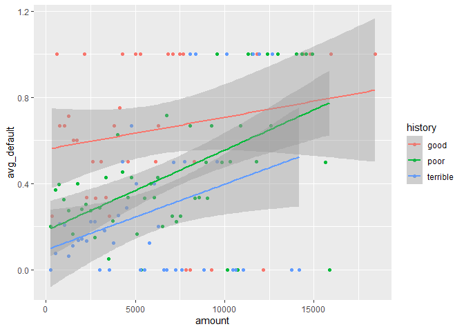
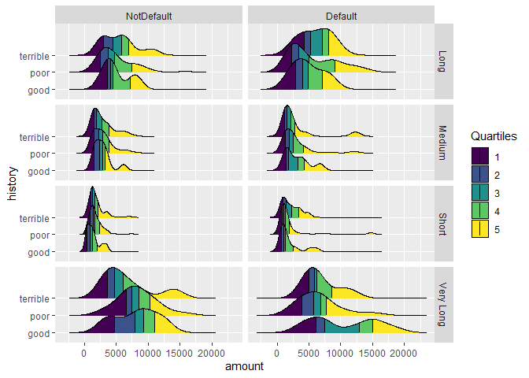
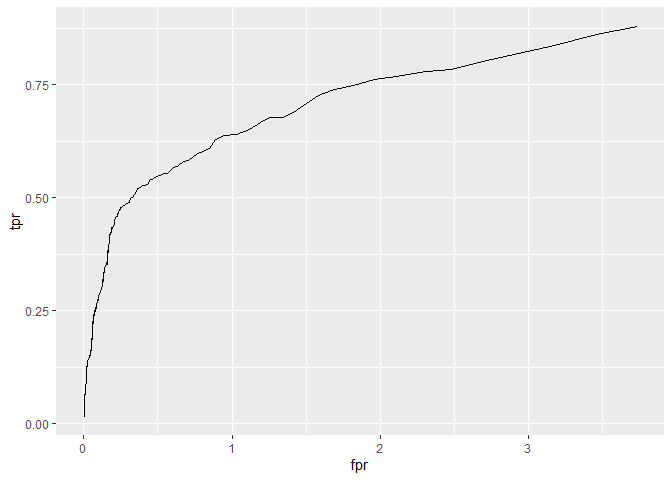
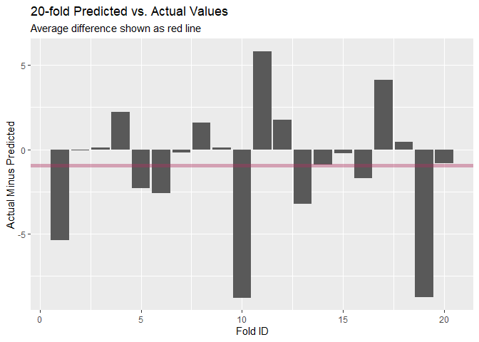

Assignment 2
================
Colin Wick
3/8/2021

# Problem 1

## Day of Week

<!-- -->

This plot shows average number of boardings per 15-minute interval over
the course of the week, broken out by month. Each section of the line
represents Weekend days have significantly lower average boarding all
day. For weekdays, there are similar boarding peaks every day, around
4:30 pm. Interestingly, there is not as much evidence for a
commute-to-work peak, with a mostly smooth increase in morning boarding.

Since this is 1 year of data, each section of each line represents
between 4 and 5 ridership days. Labor Day falls on a Monday in September
every year, which is causing significantly lower average ridership in
September systematically. This same logic applies to Wed-Fri in November
because of the Thanksgiving holiday.

## Relationship w Temperature

<!-- -->

This plot compares temperature and boarding time, broken out by weekend
and non-weekend days and hour of day. There appears to be a weak
relationship on weekdays between temperature and boarding, suggesting
that students may opt out of riding the bus when temperate but are more
likely when it is hot out. This relation ship is weak, at best, on
weekdays and non existent on weekends.

# Problem 2

<!-- -->

First, checking the dependent variable for any necessity to scale or
transform. Abnormality can be dealt with by standardization or
log-transforming the variable. However, the distribution does not appear
to deviate from a normal distribution enough to warrant a
transformation.

<!-- -->

    ## [1] "Over 50 splits, forward step regression reached an average RMSE of, 66585.62 with standard error of 5828.18"

Testing a forward linear model with interactions and a few polynomial
terms, the upper bound of this data appears to be roughly an R-squared
of .6, give or take depending on the seed of the forward regression,
polynomial terms included, and number of interactions.

Reformatting factor variables as dummies and standardizing numeric
variables, we construct a knn model and test for optimal k by iterating
on a list of k values. Constructing a matrix of mean & sd of RMSE we can
compare k values and the linear model directly.

<!-- -->

Depending on the run, the linear model and k = 5 could be argued to be
similar. Since the low-end of the linear model and the high-end of the
knn model barely touch, if at all, then on average the knn model with
k=5 should be used.

Taking this as the model, the best predictive model of house value is
the houses most similar to itself across multiple dimensions. The linear
model could be thought of as a composite of discrete home elements and
some interactions of those elements as comprising home value. This model
is not as effective as a model which compares the most generally similar
homes to the one in question.

# Problem 3

<!-- -->

    ## 
    ## Call:
    ## glm(formula = f1, family = binomial(link = "logit"), data = ger)
    ## 
    ## Deviance Residuals: 
    ##     Min       1Q   Median       3Q      Max  
    ## -2.3464  -0.8050  -0.5751   1.0250   2.4767  
    ## 
    ## Coefficients:
    ##                       Estimate Std. Error z value Pr(>|z|)    
    ## (Intercept)         -7.075e-01  4.726e-01  -1.497  0.13435    
    ## duration             2.526e-02  8.100e-03   3.118  0.00182 ** 
    ## amount               9.596e-05  3.650e-05   2.629  0.00856 ** 
    ## installment          2.216e-01  7.626e-02   2.906  0.00366 ** 
    ## age                 -2.018e-02  7.224e-03  -2.794  0.00521 ** 
    ## historypoor         -1.108e+00  2.473e-01  -4.479 7.51e-06 ***
    ## historyterrible     -1.885e+00  2.822e-01  -6.679 2.41e-11 ***
    ## purposeedu           7.248e-01  3.707e-01   1.955  0.05058 .  
    ## purposegoods/repair  1.049e-01  2.573e-01   0.408  0.68346    
    ## purposenewcar        8.545e-01  2.773e-01   3.081  0.00206 ** 
    ## purposeusedcar      -7.959e-01  3.598e-01  -2.212  0.02694 *  
    ## foreigngerman       -1.265e+00  5.773e-01  -2.191  0.02849 *  
    ## ---
    ## Signif. codes:  0 '***' 0.001 '**' 0.01 '*' 0.05 '.' 0.1 ' ' 1
    ## 
    ## (Dispersion parameter for binomial family taken to be 1)
    ## 
    ##     Null deviance: 1221.7  on 999  degrees of freedom
    ## Residual deviance: 1070.0  on 988  degrees of freedom
    ## AIC: 1094
    ## 
    ## Number of Fisher Scoring iterations: 4

A logit model including history variables finds that low-credit
applicants tend to default systematically less than high-credit
applicants. This seems intuitively incorrect. A first guess is that the
bank’s “similar sample” across mid and high credit tended to pick cases
where high credit accounts defaulted on loans rather than an even
selection of all loans.

By selecting for good-credit loans that defaulted, the model finds that,
for a given loan, low- or mid- credit borrowers are significantly more
likely to pay back the loan. One way to confirm this bias in the data is
to construct a confusion matrix, which will see whether the model is
effectively re-categorizing the data.

    ##    yhat
    ## y     0   1
    ##   0 673  27
    ##   1 257  43

    ## [1] "Out-of_sample performance: 0.716"

The model is doing a good job of predicting values, meaning that the
underlying dataset is skewed or it is actually the case that lower
credit scores predict lower chance of default.

<!-- -->

<!-- -->

The two plots above illustrate this point clearly. In the first plot we
see average default rates within bins of $250 which clearly demonstrate
a systematic bias towards “good” loans which defaulted in the dataset.
At all loan sizes, good credit loans are worse-performing than poor
credit.

The second plot shows the similarities between default and non-default
loans. Specficially, showing the similarities between credit history and
multiple dimensions of the loans including default rate, duration, and
amount. From here it is obvious that the selection criteria for these
loans was focused too much on matching the qualities of good and poor
credit loans rather than random sampling.

In the future, the best predictive model would be one with a truly
randomized sample, so there is no selection for any other qualities.
Under the data provided by the bank, a naive data scientist would
recommend the bank only give loans to poor and terrible credit clients,
while avoiding good credit. This is obviously not the right
recommendation.

# Problem 4

    ##  small custom  large 
    ##  0.921  0.936  0.936

As a first comparison metric between models, out-of-sample accuracy
shows which model is best predicting known values. From this, large and
custom models have roughly similar performance. After significant
tinkering, very little extra performance can be squeezed out of this
data but “custom” slightly outperforms “large”.

<!-- -->

This ROC curve demonstrates that the model is severely overpredicting
children systematically. At lower thresholds this problem is mitigated
somewhat and there is genuinely good performance on the left side of
this model. Further revisions need to account for this issue.

<!-- -->

A further method of cross validation is creating 20 randomized folds in
the data and predicting expected children, then comparing to the actual
values in the data. The visualization above shows the difference across
all 20 folds and an average line which consistently shows up around -1.
This is consistent with the above hypothesis that the model is
systematically overpredicting the presence of children in a given
reservation.

Not pictured above is replications of the analysis above across multiple
re-folds and comparison with the “large” model proposed in the question.
Across both of these breakdowns the same \~1 case overprediction took
place systematically.
