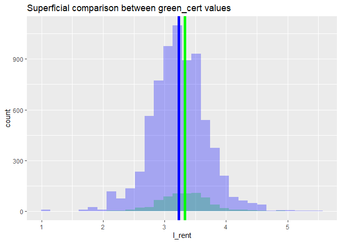
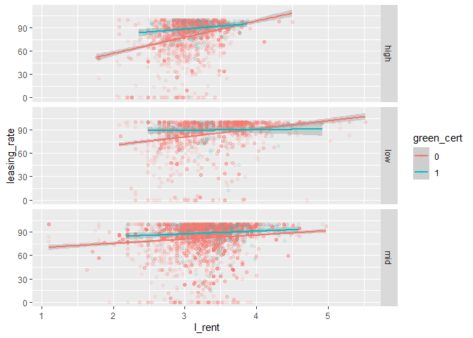
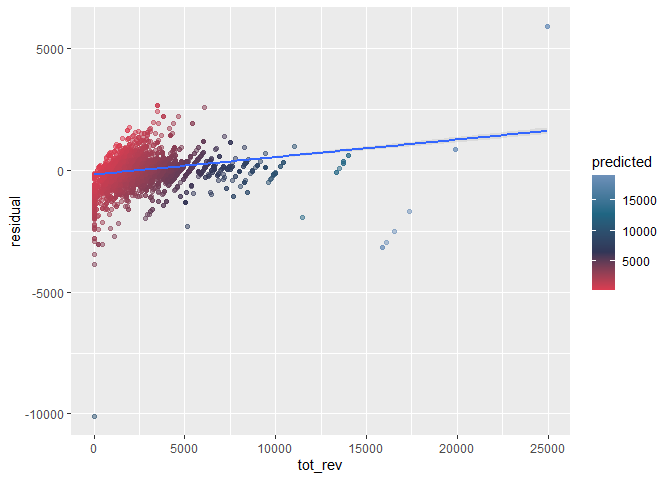
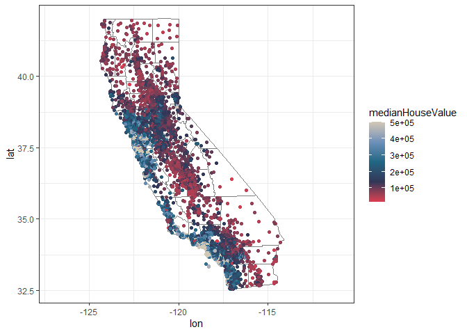
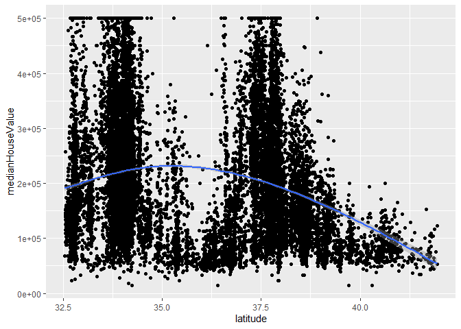
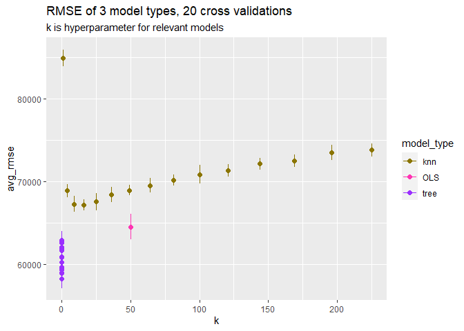
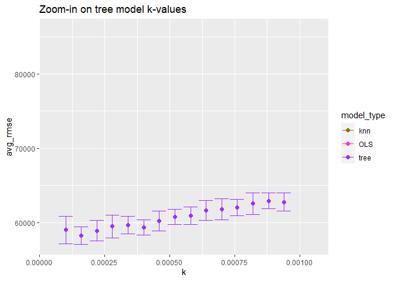
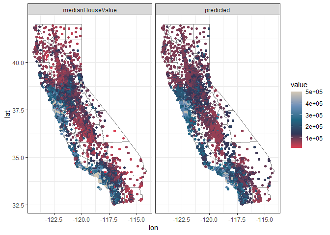
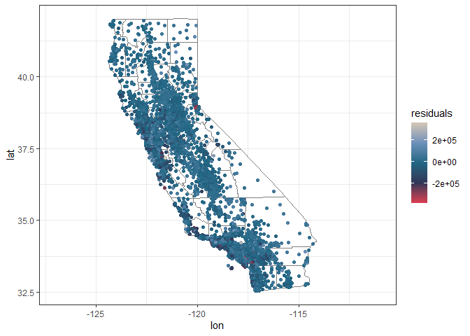
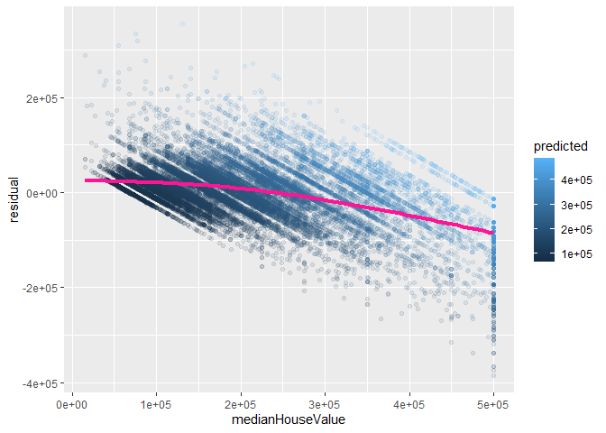

Assignment 3
================
Colin Wick
4/2/2021

``` r
knitr::opts_chunk$set(echo = F,cache = T,message = F,warning = F,background = T)
library(tidyverse)
```

    ## -- Attaching packages --------------------------------------- tidyverse 1.3.0 --

    ## v ggplot2 3.3.3     v purrr   0.3.4
    ## v tibble  3.0.6     v dplyr   1.0.4
    ## v tidyr   1.1.2     v stringr 1.4.0
    ## v readr   1.4.0     v forcats 0.5.1

    ## -- Conflicts ------------------------------------------ tidyverse_conflicts() --
    ## x dplyr::filter() masks stats::filter()
    ## x dplyr::lag()    masks stats::lag()

``` r
library(caret)
```

    ## Loading required package: lattice

    ## 
    ## Attaching package: 'caret'

    ## The following object is masked from 'package:purrr':
    ## 
    ##     lift

``` r
library(plm)
```

    ## 
    ## Attaching package: 'plm'

    ## The following objects are masked from 'package:dplyr':
    ## 
    ##     between, lead

``` r
library(modelr)
library(car)
```

    ## Loading required package: carData

    ## 
    ## Attaching package: 'car'

    ## The following object is masked from 'package:dplyr':
    ## 
    ##     recode

    ## The following object is masked from 'package:purrr':
    ## 
    ##     some

``` r
library(rsample)
library(splines)
library(rpart)
library(rpart.plot)
```

    ## Warning: package 'rpart.plot' was built under R version 4.0.5

# Question 1

## 1.

Running that regression doesn’t take into account city-specific effects,
network effects of police infrastructure, or whether the causal question
points in some other direciton.

## 2.

The researchers used terrorism threat as an instrument to estimate the
effect of more police in a way that untangles the correlation issue.
Terrorism threat will not have an influence on whether there is crime
other than the exogenous increase in number of police.

## 3.

They then control for metro ridership to ensure that the underlying
population on the street of a given day stays the same. If ridership was
significantly lower, then terrorism threat could be understood to have
an effect on the crime-commission-side of the police question.

## 4.

District 1 is the region surrounding the Federal Government parts of
Washington, D.C. (i.e. Congress, White House, and agencies). The other
districts are residential & commerical, normal city-type areas. Under a
higher terrorism threat, District 1 will see an increased presence of
police compared to the rest of the city, so comparing that district to
the rest of the city shows the difference in crime under an exogenous
increase. In this case they find a \~2 crime decrease based on increase
in police presence.

# Question 2

Feature Engineering notes:

-   green\_cert: Collapse LEED and EnergyStar into a single variable for
    simplicity (assumes “any green cert” is more valuable than branding
    of green certs)

-   create both standardized and log-scaled size & rent measures for use
    later as necessary

-   rent\_diff: a “rent differential” variable (the difference between
    city average and building-specific rent) which may be of use

-   class: collapse class vars into one factor variable

-   tot\_rev: variable of interest (leasing\_rate \* Rent) & log-scaled
    version of variable which sends 0-valued leasing rates to NA’s due
    to log-scale constraints.

Goal: Best predictive model possible for revenue per square foot per
calendar year. Estimate of Green Certification returns.

<!-- -->

First things first, we need to establish whether there is a superficial
relationship between green buildings and rent. Comparing distributions
and difference in means, it looks like there is a small relationship
before any sort of interactions or covariates are introduced.

<!-- -->

Comparing leasing rent to rent, there is a direct relationship between
the two and the magnitude seems to be roughly different across economic
growth regions. “High” represents the upper quartile of economic growth
regions in the dataset, “low” being the lower quartile, and “mid”
containing the rest. Across these dimensions there seems to be a slight
difference in slope based on these factors.

    ## Oneway (individual) effect Within Model
    ## 
    ## Call:
    ## plm(formula = l_tot_rev ~ l_size + leasing_rate + std_rent + 
    ##     empl_bucket + renovated + age + age^2 + amenities + green_cert + 
    ##     (Gas_Costs * hd_total07 + cd_total_07 * Electricity_Costs), 
    ##     data = grn, model = "within", index = c("cluster"))
    ## 
    ## Unbalanced Panel: n = 691, T = 1-84, N = 7742
    ## 
    ## Residuals:
    ##       Min.    1st Qu.     Median    3rd Qu.       Max. 
    ## -7.0683736 -0.0752007  0.0084182  0.1107829  3.5644527 
    ## 
    ## Coefficients:
    ##                                  Estimate  Std. Error t-value  Pr(>|t|)    
    ## l_size                         1.2071e-02  4.5551e-03  2.6499  0.008068 ** 
    ## leasing_rate                   2.1472e-02  2.2889e-04 93.8101 < 2.2e-16 ***
    ## std_rent                       3.0785e-01  5.9725e-03 51.5438 < 2.2e-16 ***
    ## renovated                     -1.9138e-02  9.4604e-03 -2.0230  0.043115 *  
    ## age                           -3.5095e-04  1.8022e-04 -1.9473  0.051535 .  
    ## amenities                      3.8208e-02  9.6575e-03  3.9563 7.686e-05 ***
    ## green_cert1                    9.9963e-03  1.5541e-02  0.6432  0.520087    
    ## Gas_Costs                     -8.4976e+02  1.5526e+03 -0.5473  0.584193    
    ## Electricity_Costs             -9.0211e+02  1.2495e+03 -0.7220  0.470338    
    ## Gas_Costs:hd_total07           1.5733e-01  3.7771e-01  0.4165  0.677034    
    ## cd_total_07:Electricity_Costs  4.3130e-01  5.2122e-01  0.8275  0.407991    
    ## ---
    ## Signif. codes:  0 '***' 0.001 '**' 0.01 '*' 0.05 '.' 0.1 ' ' 1
    ## 
    ## Total Sum of Squares:    2187.5
    ## Residual Sum of Squares: 725.5
    ## R-Squared:      0.66834
    ## Adj. R-Squared: 0.63532
    ## F-statistic: 1289.71 on 11 and 7040 DF, p-value: < 2.22e-16

Setting up a “simple” model using all variables and interactions which
seem to be obviously important in determining rent. This includes linear
terms for most variables. Age squared is included because this tends to
be an important factor in questions of age. I interact cooling days with
electricity & heating days with gas because these are the times which
those variables are jointly relevant.

Immediately, we achieve an R^2 value of .77 and a significant (F-stat)
model for predicting the rent. Then, we apply a panel regression format
to the model, accounting for within-cluster variation in revenue. This
reduces the overall predictive value of the model but accounts for
important variation that must be accounted for. One way to account for
this setup is to interact “cluster” when building a black-box or ML
predictive model later in the process.

In this step I set up a simple linear regression model, then introduced
a large step regression model. The basic linear model has a lot of
benefits in terms of interpretability while the step regression allows
us to struggle towards better predictive performance at the expense of
elegance. The final model incorporated is a large tree model, which we
can expect to have the best predictive performance but lowest
interpretability.

Though somewhat colinear with total revenue, log-rent was included
because it is theoretically a choice variable. Leasing rate was excluded
because it is not a choice variable.

    ##    Model Type     RMSE  RSquared
    ## 1  stepped_sq 690.8458 0.7732178
    ## 2 stepped_add 768.2031 0.7732178
    ## 3          lm 756.2647 0.7286836
    ## 4        tree 554.1815 0.8539567

After running the tree, “messy” squared step model, cleaner “additive”
step model, and the “simple” lm model, the tree appears to reduce RMSE
by 1/2 and increase R Squared by more than 10%. For the purposes of
prediction, this is the best model to use.

    ##                   tree_model.variable.importance
    ## l_rent                               14020412179
    ## Electricity_Costs                     1188396713
    ## l_size                                1187384797
    ## cluster                               1094897419
    ## cd_total_07                            861018453
    ## age                                    648755990
    ## hd_total07                             569075593
    ## Gas_Costs                              417078828
    ## empl_bucket                             75174749
    ## amenities                               61232183
    ## renovated                               45236508
    ## LEED                                     4681191
    ## Energystar                               1117983

<!-- -->

Plotting tot\_rev (our key outcome variable) against residual values,
the model is remarkably good at fitting the center of the data but falls
apart towards the right tail of the distribution. The line is plotted to
show any systemic bias in the model. In general, the model underpredicts
more expensive revenues.

The tree “variable importance” metric shows an estimate of the effects
of each variable on the predictive value of the tree. However, Tree
models do not lend themselves well to marginal effects or statistical
significance in the traditional regression sense, so if we refer to our
strongest regression we can establish the effects of green certification
in the next section.

<table class=" lightable-classic-2" style="font-family: &quot;Arial Narrow&quot;, &quot;Source Sans Pro&quot;, sans-serif; margin-left: auto; margin-right: auto;">
<thead>
<tr>
<th style="text-align:left;">
</th>
<th style="text-align:right;">
estimate
</th>
<th style="text-align:right;">
sd
</th>
<th style="text-align:right;">
pval
</th>
</tr>
</thead>
<tbody>
<tr>
<td style="text-align:left;">
LEED\_Marginal
</td>
<td style="text-align:right;">
339.253
</td>
<td style="text-align:right;">
5.172
</td>
<td style="text-align:right;">
0.000
</td>
</tr>
<tr>
<td style="text-align:left;">
LEED
</td>
<td style="text-align:right;">
3594.734
</td>
<td style="text-align:right;">
1117.649
</td>
<td style="text-align:right;">
0.001
</td>
</tr>
<tr>
<td style="text-align:left;">
Energystar\_Marginal
</td>
<td style="text-align:right;">
81.685
</td>
<td style="text-align:right;">
0.767
</td>
<td style="text-align:right;">
0.000
</td>
</tr>
<tr>
<td style="text-align:left;">
Energystar
</td>
<td style="text-align:right;">
569.845
</td>
<td style="text-align:right;">
255.686
</td>
<td style="text-align:right;">
0.026
</td>
</tr>
</tbody>
</table>

Referring back to the strongest OLS model, we see that, on the margin,
there is a return to LEED & Energystar certification. Breaking them out
was important because we will see potential branding effects between the
two certifications. The effects of certification are broken out 2 ways.
First, looking at averages, LEED is potentially worth thousands of
dollars per square foot and Energystar hundreds, though this is
dependent on potential interactions in the model.

However, these sample averages, though extracted from a regression with
many controls, do not tell the whole story. Another perspective is
looking on the margin. From this perspective, the question is “given all
else equal, what happens if a given building moves from not-LEED to
LEED?” which tells a different story. LEED buildings have roughly
$330-350 higher revenue per sqft if they achieve certification on the
margin. Similarly, but smaller magnitude, Energystar certification is
worth $81 per sqft on the margin.

A better way to measure the difference in this case is using the
marginal effects, since this mode of analysis takes into account
similarities between buildings and focuses on the effect of moving a
giving building from non-certified to certified, rather than looking at
population level averages.

# Question 3

## Part 1

<!-- -->

First, just plotting median house value against long-lat to see if any
immediately visible features of the data arise. From here it’s clear
that splines will be necessary for long-lat since there is a bimodal
peak of median house value around the Bay area and Los Angeles.

<!-- -->

<!-- --><!-- -->

    ## # A tibble: 1 x 4
    ## # Groups:   k [1]
    ##         k model_type avg_rmse sd_rmse
    ##     <dbl> <chr>         <dbl>   <dbl>
    ## 1 0.00016 tree         58263.   1182.

The two charts above show mean RMSE across 20 cross validations for 3
different model types and 15 hyperparameter tunings.

Iterating 20 cross validations of 15 tree parameters, a large OLS Step
regression, and 15 knn parameters, the best model available is the tree
model. Using a tree model we find that cp = .00046 produces the best
model since it is statistically indistinguishable from the lowest value
but less computationally intensive.

A knn model may find interactions and assocations in the data and OLS is
most easily interpretable, which are unique benefits to each. However,
for the purpose of pure prediction, tree is best in this case.

<!-- -->

From a quick visual perspective, the model appears to perform very well
in general. For the most part, there is the same regional distinction
and scale of difference between regions. It’s immediately obvious,
however, that this model compressed variation across tracts in the same
region. For example, looking at particularly high-value (Bay Area/LA)
there appears to be some amount of value shaved-off. More inland, the
model is predicting slightly higher values than the actual data.

<!-- --> The
picture above plots residuals against long-lat coordinates. There is a
relatively uniform spread of residuals, except for a clear bias on
coastal regions, which tended to also have higher median home values. In
future models, allowing for engineering, a “distance to coast” variable
will serve this dataset well.

<!-- -->

Finally, confirming the downward bias of this model against high-value
tracts.
