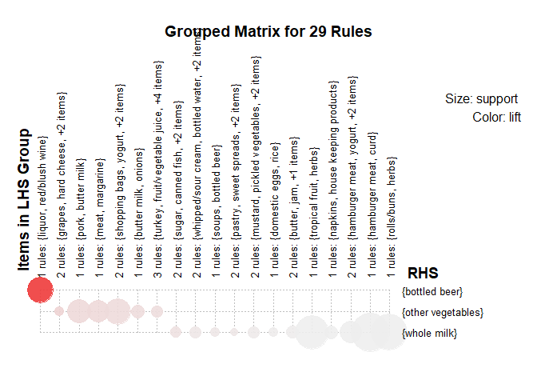

Excersize 4
================
Colin Wick
Last compiled on 06 May, 2021

# Question 1 - Wine Classification

### Clustering Color

<table class=" lightable-minimal" style="font-family: &quot;Trebuchet MS&quot;, verdana, sans-serif; margin-left: auto; margin-right: auto;">
<thead>
<tr>
<th style="text-align:left;">
cluster
</th>
<th style="text-align:right;">
red
</th>
<th style="text-align:right;">
white
</th>
</tr>
</thead>
<tbody>
<tr>
<td style="text-align:left;">
1
</td>
<td style="text-align:right;">
0.0156348
</td>
<td style="text-align:right;">
0.9808085
</td>
</tr>
<tr>
<td style="text-align:left;">
2
</td>
<td style="text-align:right;">
0.9843652
</td>
<td style="text-align:right;">
0.0191915
</td>
</tr>
</tbody>
</table>

A quick clustering method easily classifies 98% of each wine color,
which is hard to beat.

<!-- --><!-- -->

Running clustering algorithm on quality does not yield the same results.
The algorithm successfully predicted color but only loosely predicts
quality. Notice clusters 1, 2, and 3 which have higher quality
concentrations but did not adequately cluster.

    ## Importance of first k=2 (out of 12) components:
    ##                           PC1    PC2
    ## Standard deviation     1.7440 1.6278
    ## Proportion of Variance 0.2535 0.2208
    ## Cumulative Proportion  0.2535 0.4743

<!-- -->

PCA somewhat successfully predicts wine color, but not as well as
clustering. This is an artifact of the clustering algorithm’s neccesary
binning while PCA can have a smoother distribution across factors.

    ## Importance of first k=7 (out of 12) components:
    ##                           PC1    PC2    PC3    PC4     PC5     PC6    PC7
    ## Standard deviation     1.9518 1.5902 1.2496 0.9853 0.85077 0.78329 0.7324
    ## Proportion of Variance 0.3175 0.2107 0.1301 0.0809 0.06032 0.05113 0.0447
    ## Cumulative Proportion  0.3175 0.5282 0.6583 0.7392 0.79952 0.85065 0.8953

<!-- --><!-- -->

Running a linear regression on the 7 PCAs, we find that each PC vector
slightly predicts quality, but none in particular are selecting for
quality, so we would need to introduce an absurd number of PCAs to the
system. At that point, we may as well just predict using the features
themselves.

# Question 2 - Social Marketing

<table class=" lightable-minimal" style="font-family: &quot;Trebuchet MS&quot;, verdana, sans-serif; margin-left: auto; margin-right: auto;">
<thead>
<tr>
<th style="text-align:left;">
Topic
</th>
<th style="text-align:right;">
Count
</th>
</tr>
</thead>
<tbody>
<tr>
<td style="text-align:left;">
photo\_sharing
</td>
<td style="text-align:right;">
21256
</td>
</tr>
<tr>
<td style="text-align:left;">
health\_nutrition
</td>
<td style="text-align:right;">
20235
</td>
</tr>
<tr>
<td style="text-align:left;">
cooking
</td>
<td style="text-align:right;">
15750
</td>
</tr>
<tr>
<td style="text-align:left;">
politics
</td>
<td style="text-align:right;">
14098
</td>
</tr>
<tr>
<td style="text-align:left;">
sports\_fandom
</td>
<td style="text-align:right;">
12564
</td>
</tr>
<tr>
<td style="text-align:left;">
travel
</td>
<td style="text-align:right;">
12493
</td>
</tr>
<tr>
<td style="text-align:left;">
college\_uni
</td>
<td style="text-align:right;">
12213
</td>
</tr>
<tr>
<td style="text-align:left;">
current\_events
</td>
<td style="text-align:right;">
12030
</td>
</tr>
<tr>
<td style="text-align:left;">
personal\_fitness
</td>
<td style="text-align:right;">
11524
</td>
</tr>
<tr>
<td style="text-align:left;">
food
</td>
<td style="text-align:right;">
11015
</td>
</tr>
</tbody>
</table>

From here we see the beginnings of the market structure just by looking
at aggregate mentions of each topic, but this is not a detailed
marketing strategy.

<!-- -->

We removed the “chatter” category because everyone chatters now and
then. Instead, we look at the likelihood of people to talk about a topic
based on talking about another. The visualization above creates groups
based on people’s likely topics of conversation. Though most of these
seem intuitive, the clear topic groupings.

The size of each node represents the amount of times it appeared in the
data, meaning a higher share of the audience consistently talked about
the topic. From this we see multiple clear segments;

1.  An outdoorsy, personal health and fitness type consumer, likely to
    be marketed to via signage and retail placement.

2.  An online gaming college student consumer, likely to be marketed to
    on Twitch and other gaming-oriented social media sites.

3.  A beauty, cooking, fashion, and photo sharing consumer, likely
    marketed to on Instagram.

4.  Politics, news, travel, and automotive interested consumer, likely
    marketed to on Facebook and Twitter.

5.  The food, religion, parenting consumer, who may be more difficult to
    reach in a measured way due to the low relative concentration on any
    particular digital media. Grocery stores and traditional media would
    be likely places to build your brand.

<table class=" lightable-minimal" style="font-family: &quot;Trebuchet MS&quot;, verdana, sans-serif; margin-left: auto; margin-right: auto;">
<thead>
<tr>
<th style="text-align:left;">
Cluster 1
</th>
<th style="text-align:left;">
Cluster 2
</th>
<th style="text-align:left;">
Cluster 3
</th>
<th style="text-align:left;">
Cluster 4
</th>
<th style="text-align:left;">
Cluster 5
</th>
</tr>
</thead>
<tbody>
<tr>
<td style="text-align:left;">
photo\_sharing
</td>
<td style="text-align:left;">
college\_uni
</td>
<td style="text-align:left;">
politics
</td>
<td style="text-align:left;">
health\_nutrition
</td>
<td style="text-align:left;">
sports\_fandom
</td>
</tr>
<tr>
<td style="text-align:left;">
health\_nutrition
</td>
<td style="text-align:left;">
online\_gaming
</td>
<td style="text-align:left;">
travel
</td>
<td style="text-align:left;">
cooking
</td>
<td style="text-align:left;">
religion
</td>
</tr>
<tr>
<td style="text-align:left;">
current\_events
</td>
<td style="text-align:left;">
photo\_sharing
</td>
<td style="text-align:left;">
news
</td>
<td style="text-align:left;">
photo\_sharing
</td>
<td style="text-align:left;">
food
</td>
</tr>
<tr>
<td style="text-align:left;">
travel
</td>
<td style="text-align:left;">
sports\_playing
</td>
<td style="text-align:left;">
computers
</td>
<td style="text-align:left;">
personal\_fitness
</td>
<td style="text-align:left;">
parenting
</td>
</tr>
<tr>
<td style="text-align:left;">
shopping
</td>
<td style="text-align:left;">
health\_nutrition
</td>
<td style="text-align:left;">
photo\_sharing
</td>
<td style="text-align:left;">
fashion
</td>
<td style="text-align:left;">
school
</td>
</tr>
</tbody>
</table>

Above is the top topics that emerged per-cluster after a completely
different algorithm was run against the data. Notice the same pattern
emerges under this methodology, emphasizing the natural audiences in the
data.

# Question 3 - Market Segmentation

First we load the data.

We can examine the sparse matrix of transactions and items in a simple
plot.

<!-- -->

    ## null device 
    ##           1

What are the most frequent item purchases?

    ## Eclat
    ## 
    ## parameter specification:
    ##  tidLists support minlen maxlen            target  ext
    ##     FALSE    0.07      1     15 frequent itemsets TRUE
    ## 
    ## algorithmic control:
    ##  sparse sort verbose
    ##       7   -2    TRUE
    ## 
    ## Absolute minimum support count: 688 
    ## 
    ## create itemset ... 
    ## set transactions ...[169 item(s), 9835 transaction(s)] done [0.00s].
    ## sorting and recoding items ... [18 item(s)] done [0.00s].
    ## creating sparse bit matrix ... [18 row(s), 9835 column(s)] done [0.00s].
    ## writing  ... [19 set(s)] done [0.00s].
    ## Creating S4 object  ... done [0.00s].

    ## set of 19 itemsets
    ## 
    ## most frequent items:
    ## other vegetables       whole milk          sausage     citrus fruit 
    ##                2                2                1                1 
    ##   tropical fruit          (Other) 
    ##                1               13 
    ## 
    ## element (itemset/transaction) length distribution:sizes
    ##  1  2 
    ## 18  1 
    ## 
    ##    Min. 1st Qu.  Median    Mean 3rd Qu.    Max. 
    ##   1.000   1.000   1.000   1.053   1.000   2.000 
    ## 
    ## summary of quality measures:
    ##     support        transIdenticalToItemsets     count       
    ##  Min.   :0.07168   Min.   : 705.0           Min.   : 705.0  
    ##  1st Qu.:0.07875   1st Qu.: 774.5           1st Qu.: 774.5  
    ##  Median :0.09395   Median : 924.0           Median : 924.0  
    ##  Mean   :0.11410   Mean   :1122.2           Mean   :1122.2  
    ##  3rd Qu.:0.12501   3rd Qu.:1229.5           3rd Qu.:1229.5  
    ##  Max.   :0.25552   Max.   :2513.0           Max.   :2513.0  
    ## 
    ## includes transaction ID lists: FALSE 
    ## 
    ## mining info:
    ##       data ntransactions support
    ##  Groceries          9835    0.07

Next, we use the `apriori` function, which implements the Apriori
algorithm to mine frequent itemsets, to define rules for purchasing
associations.

    ## Apriori
    ## 
    ## Parameter specification:
    ##  confidence minval smax arem  aval originalSupport maxtime support minlen
    ##         0.8    0.1    1 none FALSE            TRUE       5   0.001      1
    ##  maxlen target  ext
    ##       3  rules TRUE
    ## 
    ## Algorithmic control:
    ##  filter tree heap memopt load sort verbose
    ##     0.1 TRUE TRUE  FALSE TRUE    2    TRUE
    ## 
    ## Absolute minimum support count: 9 
    ## 
    ## set item appearances ...[0 item(s)] done [0.00s].
    ## set transactions ...[169 item(s), 9835 transaction(s)] done [0.00s].
    ## sorting and recoding items ... [157 item(s)] done [0.00s].
    ## creating transaction tree ... done [0.00s].
    ## checking subsets of size 1 2 3 done [0.00s].
    ## writing ... [29 rule(s)] done [0.00s].
    ## creating S4 object  ... done [0.00s].

    ## set of 29 rules
    ## 
    ## rule length distribution (lhs + rhs):sizes
    ##  3 
    ## 29 
    ## 
    ##    Min. 1st Qu.  Median    Mean 3rd Qu.    Max. 
    ##       3       3       3       3       3       3 
    ## 
    ## summary of quality measures:
    ##     support           confidence        coverage             lift       
    ##  Min.   :0.001017   Min.   :0.8000   Min.   :0.001118   Min.   : 3.131  
    ##  1st Qu.:0.001118   1st Qu.:0.8125   1st Qu.:0.001220   1st Qu.: 3.261  
    ##  Median :0.001220   Median :0.8462   Median :0.001525   Median : 3.613  
    ##  Mean   :0.001473   Mean   :0.8613   Mean   :0.001732   Mean   : 4.000  
    ##  3rd Qu.:0.001729   3rd Qu.:0.9091   3rd Qu.:0.002135   3rd Qu.: 4.199  
    ##  Max.   :0.002542   Max.   :1.0000   Max.   :0.003152   Max.   :11.235  
    ##      count      
    ##  Min.   :10.00  
    ##  1st Qu.:11.00  
    ##  Median :12.00  
    ##  Mean   :14.48  
    ##  3rd Qu.:17.00  
    ##  Max.   :25.00  
    ## 
    ## mining info:
    ##       data ntransactions support confidence
    ##  Groceries          9835   0.001        0.8

Some of the rules can be visualized.

<!-- --><!-- --><!-- -->

| support | confidence | coverage |    lift | count |
|--------:|-----------:|---------:|--------:|------:|
|  0.0019 |     0.9048 |   0.0021 | 11.2353 |    19 |
|  0.0010 |     0.9091 |   0.0011 |  3.5579 |    10 |
|  0.0017 |     0.8095 |   0.0021 |  3.1682 |    17 |
|  0.0010 |     0.8333 |   0.0012 |  3.2614 |    10 |
|  0.0011 |     0.9167 |   0.0012 |  3.5875 |    11 |
|  0.0013 |     0.8125 |   0.0016 |  3.1798 |    13 |

<!-- -->

    ## Available control parameters (with default values):
    ## main  =  Graph for 29 rules
    ## max   =  100
    ## nodeCol   =  c("#EE0000FF", "#EE0303FF", "#EE0606FF", "#EE0909FF", "#EE0C0CFF", "#EE0F0FFF", "#EE1212FF", "#EE1515FF", "#EE1818FF", "#EE1B1BFF", "#EE1E1EFF", "#EE2222FF", "#EE2525FF", "#EE2828FF", "#EE2B2BFF", "#EE2E2EFF", "#EE3131FF", "#EE3434FF", "#EE3737FF", "#EE3A3AFF", "#EE3D3DFF", "#EE4040FF", "#EE4444FF", "#EE4747FF", "#EE4A4AFF", "#EE4D4DFF", "#EE5050FF", "#EE5353FF", "#EE5656FF", "#EE5959FF", "#EE5C5CFF", "#EE5F5FFF", "#EE6262FF", "#EE6666FF", "#EE6969FF", "#EE6C6CFF", "#EE6F6FFF", "#EE7272FF", "#EE7575FF",  "#EE7878FF", "#EE7B7BFF", "#EE7E7EFF", "#EE8181FF", "#EE8484FF", "#EE8888FF", "#EE8B8BFF", "#EE8E8EFF", "#EE9191FF", "#EE9494FF", "#EE9797FF", "#EE9999FF", "#EE9B9BFF", "#EE9D9DFF", "#EE9F9FFF", "#EEA0A0FF", "#EEA2A2FF", "#EEA4A4FF", "#EEA5A5FF", "#EEA7A7FF", "#EEA9A9FF", "#EEABABFF", "#EEACACFF", "#EEAEAEFF", "#EEB0B0FF", "#EEB1B1FF", "#EEB3B3FF", "#EEB5B5FF", "#EEB7B7FF", "#EEB8B8FF", "#EEBABAFF", "#EEBCBCFF", "#EEBDBDFF", "#EEBFBFFF", "#EEC1C1FF", "#EEC3C3FF", "#EEC4C4FF", "#EEC6C6FF", "#EEC8C8FF",  "#EEC9C9FF", "#EECBCBFF", "#EECDCDFF", "#EECFCFFF", "#EED0D0FF", "#EED2D2FF", "#EED4D4FF", "#EED5D5FF", "#EED7D7FF", "#EED9D9FF", "#EEDBDBFF", "#EEDCDCFF", "#EEDEDEFF", "#EEE0E0FF", "#EEE1E1FF", "#EEE3E3FF", "#EEE5E5FF", "#EEE7E7FF", "#EEE8E8FF", "#EEEAEAFF", "#EEECECFF", "#EEEEEEFF")
    ## itemnodeCol   =  #66CC66FF
    ## edgeCol   =  #ABABABFF
    ## labelCol  =  #000000B3
    ## itemLabels    =  TRUE
    ## measureLabels     =  FALSE
    ## precision     =  3
    ## arrowSize     =  0.5
    ## alpha     =  0.5
    ## cex   =  1
    ## layout    =  NULL
    ## layoutParams  =  list()
    ## engine    =  igraph
    ## plot  =  TRUE
    ## plot_options  =  list()
    ## verbose   =  FALSE

<!-- -->

    ## Available control parameters (with default values):
    ## main  =  Parallel coordinates plot for 29 rules
    ## reorder   =  FALSE
    ## interactive   =  FALSE
    ## engine    =  default
    ## gp_labels     =  list()
    ## newpage   =  TRUE
    ## col   =  c("#EE0000FF", "#EE0303FF", "#EE0606FF", "#EE0909FF", "#EE0C0CFF", "#EE0F0FFF", "#EE1212FF", "#EE1515FF", "#EE1818FF", "#EE1B1BFF", "#EE1E1EFF", "#EE2222FF", "#EE2525FF", "#EE2828FF", "#EE2B2BFF", "#EE2E2EFF", "#EE3131FF", "#EE3434FF", "#EE3737FF", "#EE3A3AFF", "#EE3D3DFF", "#EE4040FF", "#EE4444FF", "#EE4747FF", "#EE4A4AFF", "#EE4D4DFF", "#EE5050FF", "#EE5353FF", "#EE5656FF", "#EE5959FF", "#EE5C5CFF", "#EE5F5FFF", "#EE6262FF", "#EE6666FF", "#EE6969FF", "#EE6C6CFF", "#EE6F6FFF", "#EE7272FF", "#EE7575FF",  "#EE7878FF", "#EE7B7BFF", "#EE7E7EFF", "#EE8181FF", "#EE8484FF", "#EE8888FF", "#EE8B8BFF", "#EE8E8EFF", "#EE9191FF", "#EE9494FF", "#EE9797FF", "#EE9999FF", "#EE9B9BFF", "#EE9D9DFF", "#EE9F9FFF", "#EEA0A0FF", "#EEA2A2FF", "#EEA4A4FF", "#EEA5A5FF", "#EEA7A7FF", "#EEA9A9FF", "#EEABABFF", "#EEACACFF", "#EEAEAEFF", "#EEB0B0FF", "#EEB1B1FF", "#EEB3B3FF", "#EEB5B5FF", "#EEB7B7FF", "#EEB8B8FF", "#EEBABAFF", "#EEBCBCFF", "#EEBDBDFF", "#EEBFBFFF", "#EEC1C1FF", "#EEC3C3FF", "#EEC4C4FF", "#EEC6C6FF", "#EEC8C8FF",  "#EEC9C9FF", "#EECBCBFF", "#EECDCDFF", "#EECFCFFF", "#EED0D0FF", "#EED2D2FF", "#EED4D4FF", "#EED5D5FF", "#EED7D7FF", "#EED9D9FF", "#EEDBDBFF", "#EEDCDCFF", "#EEDEDEFF", "#EEE0E0FF", "#EEE1E1FF", "#EEE3E3FF", "#EEE5E5FF", "#EEE7E7FF", "#EEE8E8FF", "#EEEAEAFF", "#EEECECFF", "#EEEEEEFF")
    ## alpha     =  NULL
    ## quality   =  2
    ## verbose   =  FALSE

<!-- -->

From the visualizations and the summaries of item pairs, I recommend the
following aisles:

1.  Groceries Aisle – Milk, Eggs and Vegetables
2.  Liquor Aisle – Liquor, Red/Blush Wine, Bottled Beer, Soda
3.  Eateries Aisle – Herbs, Tropical Fruits, Rolls/Buns, Fruit Juices,
    Jams
4.  Breakfast Aisle – Cereals, Yogurt, Rice, Curd

# Question 4 - Author Attribution

First, we load the data.

Then we pull author names from the file directory and assign them to
texts, and do a check to make sure it worked as expected.

| Var1              | Freq |
|:------------------|-----:|
| AaronPressman     |   50 |
| AlanCrosby        |   50 |
| AlexanderSmith    |   50 |
| BenjaminKangLim   |   50 |
| BernardHickey     |   50 |
| BradDorfman       |   50 |
| DarrenSchuettler  |   50 |
| DavidLawder       |   50 |
| EdnaFernandes     |   50 |
| EricAuchard       |   50 |
| FumikoFujisaki    |   50 |
| GrahamEarnshaw    |   50 |
| HeatherScoffield  |   50 |
| JaneMacartney     |   50 |
| JanLopatka        |   50 |
| JimGilchrist      |   50 |
| JoeOrtiz          |   50 |
| JohnMastrini      |   50 |
| JonathanBirt      |   50 |
| JoWinterbottom    |   50 |
| KarlPenhaul       |   50 |
| KeithWeir         |   50 |
| KevinDrawbaugh    |   50 |
| KevinMorrison     |   50 |
| KirstinRidley     |   50 |
| KouroshKarimkhany |   50 |
| LydiaZajc         |   50 |
| LynneO’Donnell    |   50 |
| LynnleyBrowning   |   50 |
| MarcelMichelson   |   50 |
| MarkBendeich      |   50 |
| MartinWolk        |   50 |
| MatthewBunce      |   50 |
| MichaelConnor     |   50 |
| MureDickie        |   50 |
| NickLouth         |   50 |
| PatriciaCommins   |   50 |
| PeterHumphrey     |   50 |
| PierreTran        |   50 |
| RobinSidel        |   50 |
| RogerFillion      |   50 |
| SamuelPerry       |   50 |
| SarahDavison      |   50 |
| ScottHillis       |   50 |
| SimonCowell       |   50 |
| TanEeLyn          |   50 |
| TheresePoletti    |   50 |
| TimFarrand        |   50 |
| ToddNissen        |   50 |
| WilliamKazer      |   50 |

Next, we create the corpus. This is split into a train/test and are
stripped of punctuation, forced to lowercase, and numbers are removed —
as well as whitespace and common stopwords. I use simple wordclouds to
check if this process is working as expected.

<!-- -->

To analyze the text, I create document-term matrices from the corpuses.

Finally, with the document-term matrices, I use a naive-bayes classifier
to predict the author of the text using a dictionary of words unique to
each article.

``` r
## Naive Bayes Classification
freq_words <- findFreqTerms(train_dtm, 5)
# saving List using Dictionary() Function
Dictionary <- function(x) {
  if (is.character(x)) {
    return(x)
  }
  stop('x is not a character vector')
}
data_dict <- Dictionary(findFreqTerms(train_dtm, 5))
# appending Document Term Matrix to Train and Test Dataset 
data_train <- DocumentTermMatrix(train_corpus, list(data_dict))
data_test <- DocumentTermMatrix(test_corpus, list(data_dict))
# converting the frequency of word to count
convert_counts <- function(x) {
  x <- ifelse(x > 0, 1, 0)
  x <- factor(x, levels = c(0, 1), labels = c("No", "Yes")) 
  return(x)
}
# appending count function to Train and Test Dataset
data_train <- apply(data_train, MARGIN = 2, convert_counts)
data_test <- apply(data_test, MARGIN = 2, convert_counts)
# train model
data_classifier <- naiveBayes(data_train, Data_train$author)
data_test_pred <- predict(data_classifier, data_test)
# CrossTable(data_test_pred, Data_test$author,
#            prop.chisq = FALSE, prop.t = FALSE,
#            dnn = c('predicted', 'actual'))
```

I apply the trained model to the test set and compare the “actual
author” to the predicted author.

    ## [1] 0.6724

This model guesses correctly (out of 50 authors) 70% of the time.
